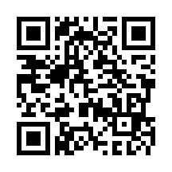
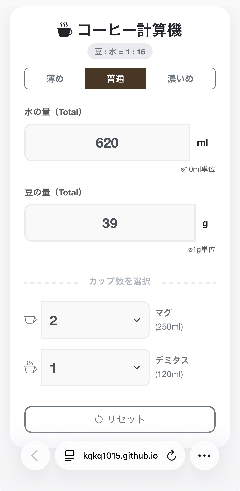

# ☕ Coffee Ratio Calculator

毎日のコーヒー抽出をサポートする、シンプルで高速なWebアプリです。
その日の気分に合わせて「薄め・普通・濃いめ」の比率を瞬時に切り替えて計算できます。

## 📱 使い方 (Access)

スマホのカメラで以下のQRコードを読み取るか、リンクをクリックしてください。
キッチンにQRコードを貼っておくと便利です。

👉 **[アプリを開く (Launch App)](https://kqkq1015.github.io/coffee-ratio/)**

  

## ✨ 特徴

* **選べる濃さ (Strength Select):**
    * **薄め (1:20)** / **普通 (1:16)** / **濃いめ (1:12)** からワンタップで選択可能。
* **双方向計算:**
    * 「水」を入力 → 必要な「豆」を算出
    * 「豆」を入力 → 必要な「水」を算出
* **カップモード (Cup Mode):**
    * マグカップ (250ml) とデミタスカップ (120ml) の個数を選択して計算可能。
    * 「マグ1杯 + デミタス1杯」のような組み合わせ計算にも対応。
* **最適化された数値:**
    * 豆は **1g単位**（整数）で表示
    * 水は **10ml単位** で表示
    * キッチンスケールで計りやすい数値に自動で丸めます。
* **使いやすいUI:**
    * スマホに最適化。数字入力時のカーソル自動移動や、カップ数のプルダウン選択など、キッチンでの操作性を追求。

## 📸 スクリーンショット

| アプリ画面 |
| --- |
|  |

## 🛠️ 技術スタック

* **HTML5**
* **JavaScript (ES6)**
* **Bootstrap 5** (Responsive UI)
* **GitHub Pages** (Hosting)

## 📝 比率設定 (Ratios)

気分に合わせて以下の3段階から選択できます。

| 設定 (Mode) | 比率 (Beans : Water) | 特徴 |
| --- | --- | --- |
| **薄め (Weak)** | 1 : 20 | すっきり楽しみたい時 |
| **普通 (Normal)** | 1 : 16 | 世界的な標準レシオ |
| **濃いめ (Strong)** | 1 : 12 | ガツンと飲みたい時 |

---
&copy; 2026 KQKQ1015